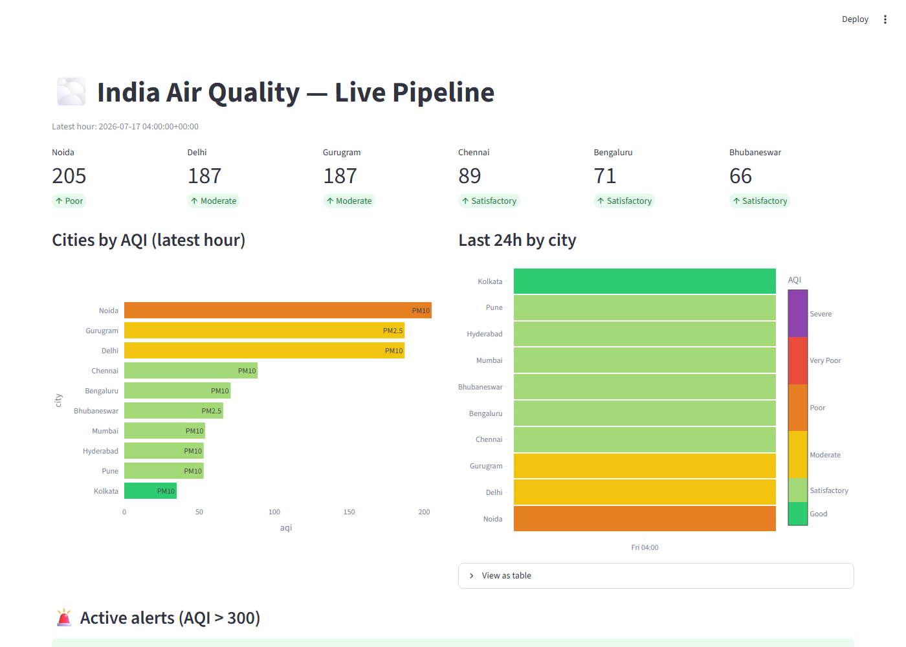
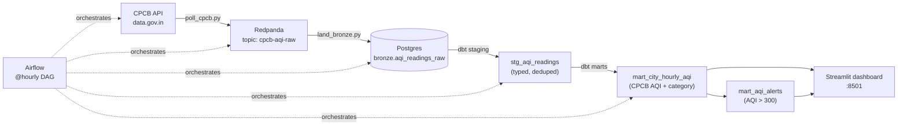
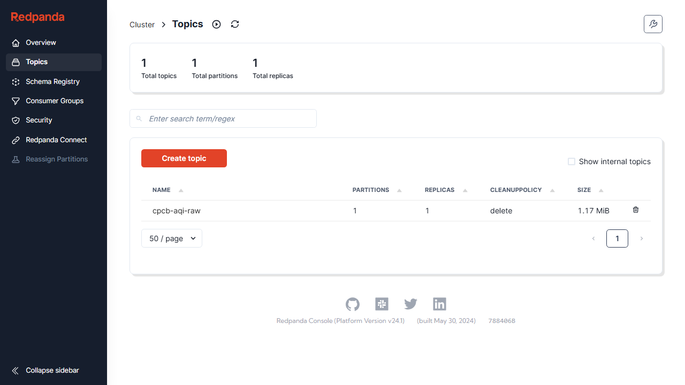
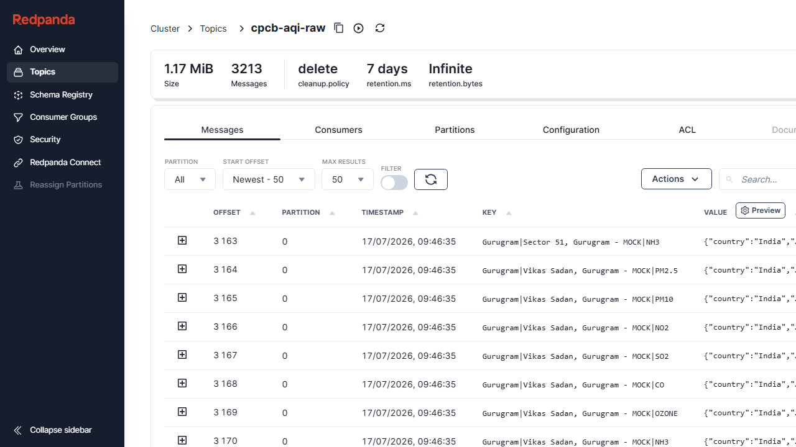
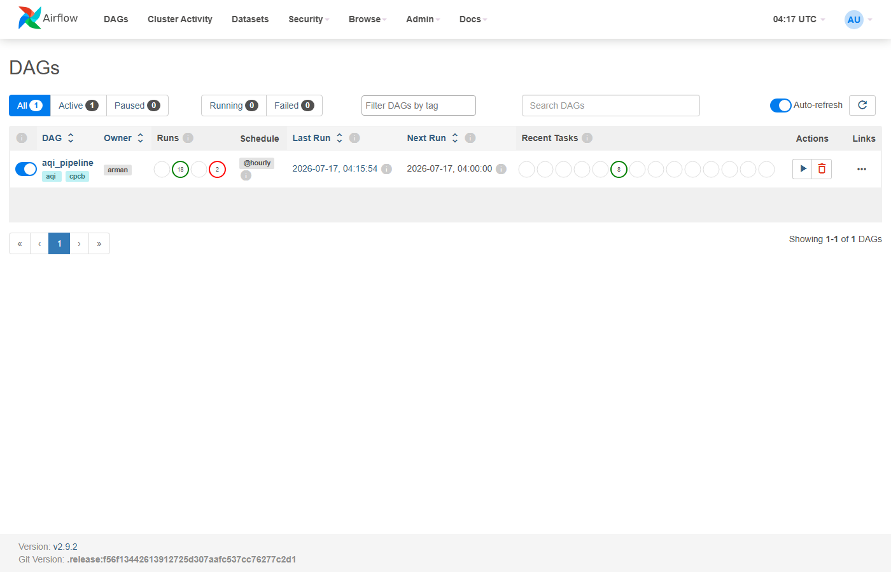
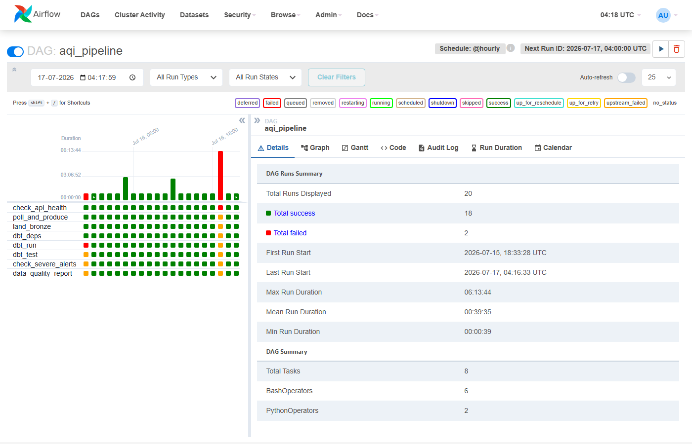
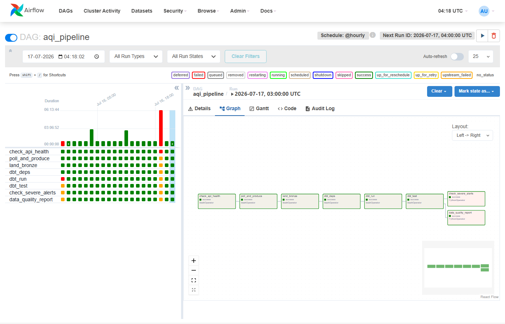
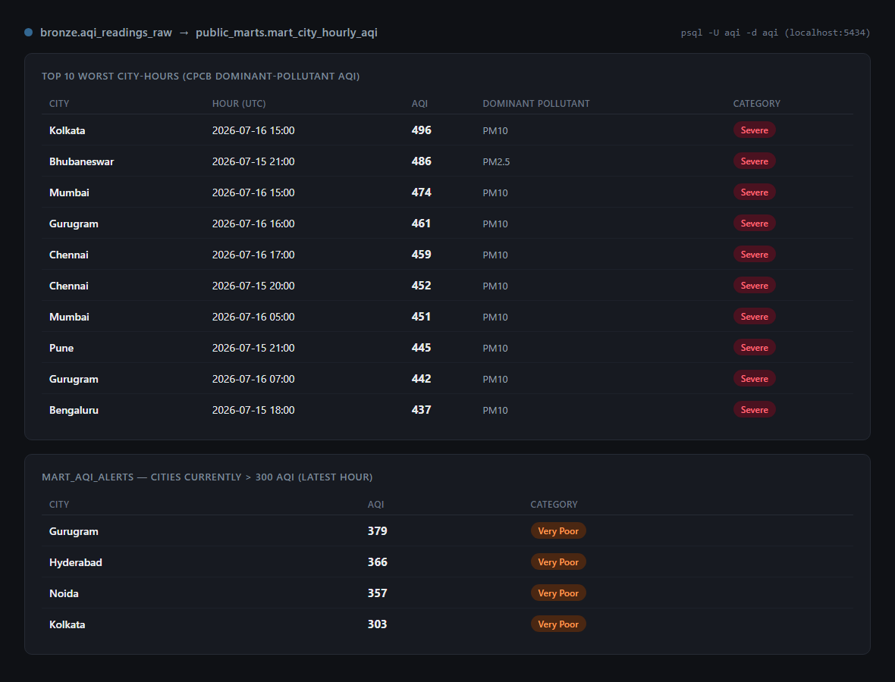
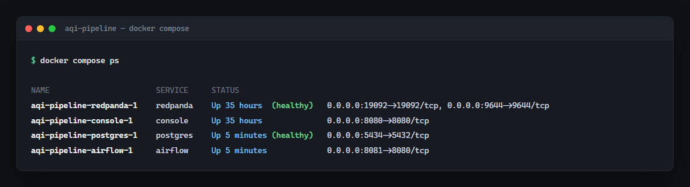

<div align="center">

# AQI India — Real-Time Air Quality Pipeline

**CPCB API → Kafka → Postgres → dbt → Airflow → Streamlit**

An hourly, self-healing ELT pipeline that ingests India's real-time Air Quality Index data,
computes the official CPCB city-level AQI methodology in dbt, and serves it on a live dashboard.


</div>

---

## Live dashboard

The Streamlit dashboard reads directly from the dbt marts — KPI tiles, a sorted city ranking, a
24-hour city × hour AQI heatmap, and an active-alerts table, refreshed every 5 minutes.



---

## How it flows



Every hour, Airflow runs: **check API health → poll & produce → land to bronze → `dbt deps` →
`dbt run` → `dbt test` + source freshness → check severe alerts → data-quality report.**

---

## Screenshots

<table>
<tr>
<td width="50%">

**Redpanda Console — topics**


</td>
<td width="50%">

**Redpanda Console — live messages**


</td>
</tr>
<tr>
<td width="50%">

**Airflow — DAG overview**
18 successful hourly runs, one intentional failure kept for the record.


</td>
<td width="50%">

**Airflow — task grid**
Per-task history across every run: health check, produce, land, dbt deps/run/test, alerts, DQ report.


</td>
</tr>
<tr>
<td width="50%">

**Airflow — DAG graph**


</td>
<td width="50%">

**Postgres — dbt marts**
Worst city-hours by CPCB AQI, and the current active-alerts mart.


</td>
</tr>
</table>

**Full stack running:**


> API behavior (auth, filtering, date formats, `"NA"` sentinel values) was validated in Postman
> against the live CPCB endpoint before writing the producer — see the notes at the top of
> [`producer/poll_cpcb.py`](producer/poll_cpcb.py).

---

## Stack

| Layer | Tool | Role |
|---|---|---|
| Ingestion | `producer/poll_cpcb.py` | Polls CPCB (or generates realistic mock data), publishes one message per (station, pollutant) |
| Streaming | **Redpanda** | Kafka-compatible broker — topic `cpcb-aqi-raw` |
| Landing | `consumer/land_bronze.py` | Bounded batch consumer, at-least-once, drains into Postgres |
| Warehouse | **Postgres 16** | `bronze` raw JSONB → `staging` typed views → `marts` business tables |
| Transform | **dbt** | Dedup, typing, CPCB AQI methodology, schema + freshness tests |
| Orchestration | **Airflow 2.9** | Hourly DAG, retries, alerting, data-quality reporting |
| Visualization | **Streamlit + Plotly** | Live dashboard on `:8501` |
| Inspection | **Redpanda Console** | Browse topics/messages on `:8080` |

---

## Quickstart

```bash
cp .env.example .env          # mock mode works out of the box, no API key needed
docker compose up -d
```

| Service | URL | Notes |
|---|---|---|
| Airflow | http://localhost:8081 | Admin credentials printed in `docker compose logs airflow` |
| Redpanda Console | http://localhost:8080 | Browse the `cpcb-aqi-raw` topic |
| Streamlit dashboard | http://localhost:8501 | Trigger the `aqi_pipeline` DAG once first |
| Postgres | `localhost:5434` | user/pass/db: `aqi` / `aqi` / `aqi` |

### Using real CPCB data
1. Register at [data.gov.in](https://data.gov.in) and generate an API key.
2. Set `DATA_GOV_API_KEY=...` and `AQI_MOCK_MODE=0` in `.env`.
3. `docker compose up -d --force-recreate airflow`

---

## Project structure

```
.
├── producer/poll_cpcb.py        # CPCB API / mock → Kafka
├── consumer/land_bronze.py      # Kafka → Postgres bronze
├── dbt/aqi/
│   └── models/
│       ├── staging/             # stg_aqi_readings — typed, deduped, tested
│       └── marts/               # mart_city_hourly_aqi, mart_aqi_alerts
├── airflow/
│   ├── Dockerfile                # base image + libpq-dev/build-essential for dbt-postgres
│   └── dags/aqi_pipeline_dag.py  # @hourly orchestration
├── dashboard/app.py              # Streamlit + Plotly
├── config.yaml                   # shared static config (cities, topic, API url)
├── scripts/init_db.sql           # bronze schema bootstrap
└── docker-compose.yml
```

---

## The CPCB AQI methodology, implemented in dbt

`mart_city_hourly_aqi` doesn't just average pollutant readings — it follows CPCB's actual rules:

1. **Average stations first** — for each city + pollutant + hour, average `avg_value` across every
   reporting station.
2. **Minimum-data rule** — a city-hour only gets an AQI if it has **≥ 3 distinct pollutants**
   reporting, **including at least PM2.5 or PM10**. City-hours that don't meet this are excluded
   entirely — no null/zero AQI rows.
3. **AQI = MAX sub-index** — the worst pollutant sub-index wins, surfaced as `dominant_pollutant`.
4. **Category bands** — Good (0–50) → Satisfactory → Moderate → Poor → Very Poor → Severe (401+).

`mart_aqi_alerts` then flags any city whose latest hour is Very Poor or worse (AQI > 300).

---

## Design notes

- **At-least-once landing:** the consumer commits Postgres *before* Kafka offsets, so a crash
  mid-batch re-lands rather than silently drops. Dedup happens downstream in `stg_aqi_readings`
  via `row_number()` partitioned on `(city, station, pollutant, hour)`.
- **Missing readings are valid data:** CPCB stations report the literal string `"NA"` for
  temporarily-down sensors. Staging converts this to real SQL `NULL` via `NULLIF`, and no blanket
  not-null test is applied to `avg_value` — the CPCB minimum-data rule downstream is the real
  data-quality gate, not a staging-level constraint.
- **Freshness tests:** `dbt source freshness` fails loudly if bronze goes stale for more than 4
  hours — stations do go offline.
- **Local dev on Windows:** `dbt/aqi/profiles.yml` resolves host/port via `PG_HOST`/`PG_PORT` env
  vars (defaulting to `localhost:5434` for host-side runs), so the same profile works whether dbt
  runs on your machine or inside the Airflow container (`postgres:5432`).
